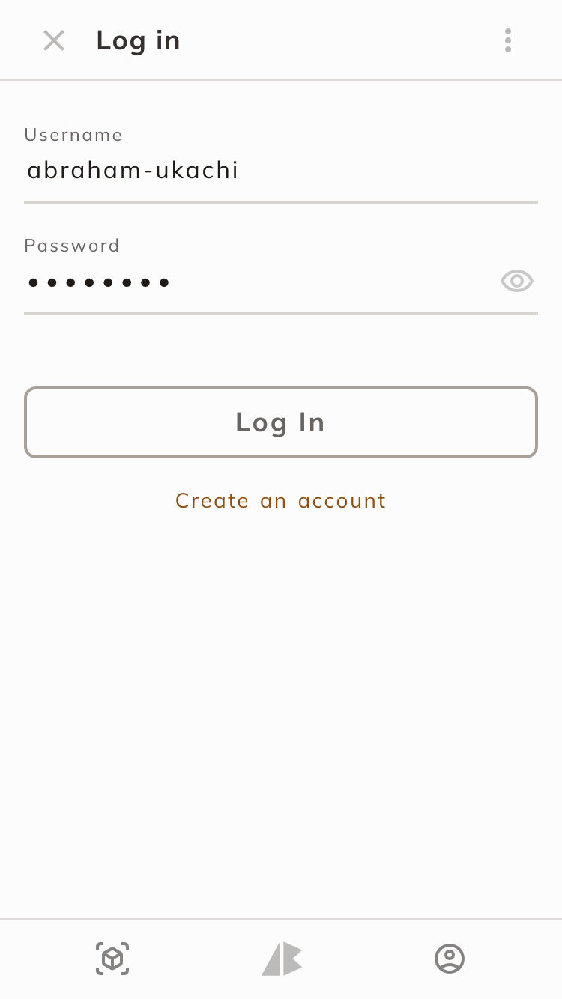
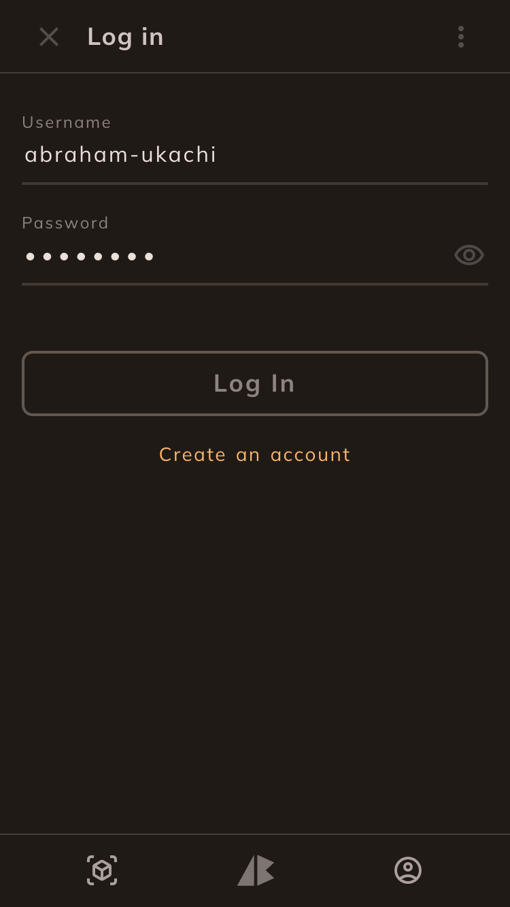
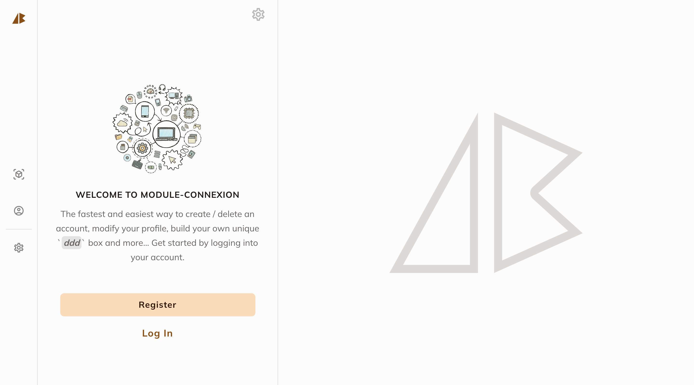

# `module-connexion`
> IMPORTANT: This is a working progress and subject to major changes until the specified deadline below.

A school project to create a simple website with PHP & SQL (via phpmyadmin) which includes **login**, **register** and **home** pages. In addition to this project's [requirements](#Requirements), I decided to create a simple 3D creator page named **DDD Studio**. 

## Description 
> Original text in French: Vous décidez de créer un module de connexion permettant aux utilisateurs de créer leur compte, de se connecter et de modifier leurs informations. Pour commencer, créez votre base de données nommée “moduleconnexion” à l’aide de phpmyadmin. Dans cette bdd, créez une table “utilisateurs” qui contient les champs suivants : id, int, clé primaire et Auto Incrément; login, varchar de taille 255; prenom, varchar de taille 255; nom, varchar de taille 255; password, varchar de taille 255

You decide to create a login module allowing users to create their account, log in and modify their information. To start, create your **database** named "**moduleconnexion**" using **_phpmyadmin_**. In this database, create a "**users**" table which contains the fields
following:

- **id**, int, primary key and Auto Increment
- **login**, varchar of size 255
- **firstname**, varchar of size 255
- **name**, varchar of size 255
- **password**, varchar of size 255

## Requirements

These are a couple of the main requirements for this school project:

1. Create a user who will be able to access all the information. His login, first name, last name and password are “admin”.
2. A home page that presents your site (index.php)
3. A page containing a registration form (register.php): The form must contain all the fields present in the “users” table (except “id”) + a password confirmation. As soon as a user fills out this form, the data is inserted into the database and the user is redirected to the login page.
4. A page containing a connection form (login.php): The form must have two inputs: “login” and “password”. When the form is validated, if there is a user in db corresponding to this information, then the user is considered to be connected and one (or more) session variables are created.
5. A page allowing you to modify your profile (profil.php): This page has a form allowing the user to modify his information. This form is by default pre-filled with the information that is currently stored in the database.
6. An administration page (admin.php): This page is accessible ONLY for the “admin” user. It is used to list all the user information present in the database.


## Jobs
> MOTTO: I'll always do [**more**](#More) 😜

The official deadline of the jobs below - according to [intra](https://intra.laplateforme.io) - was **03-12-2022 at 06:14 A.M**. Here is a list of all the names and files (i.e. `html`, `php`, `css`, etc) to be submitted as well as their corresponding / current **status** for this job:

| No. | Name | File | Status |
|:----|:-----|:-----|:-------|
| 1 | *`Home - Page`* | **index.php** | [Done](./index.php)\* |
| 2 | *`Register - Page`* | **inscription.php** | [Done](./inscription.php)\* |
| 3 | *`Login - Page`* | **connexion.php** | [Done](./connexion.php)\* |
| 4 | *`Profile - Page`* | **profil.php** | [Done](./profil.php)\* |
| 5 | *`Database - SQL`* | **moduleconnexion.sql** | Pending |
| 6 | *`DDD Studio - Page`* | **ddd-studio.php** | [Done](./ddd-studio.php)\*_ |

> NOTE: (\*) = still needs to be updated


## Structure

The folder & file structure of this project:
  
- [**assets**](./assets/)
- - [**logos**](./assets/logos/)
- - [**images**](./assets/images/)
- - ...
- - [**animations**](./assets/animations/)
- - * *fade-in-animation.css*
- - * *pop-in-animation.css*
- - * *slide-from-down-animation.css*
- - [**theme**](./assets/theme/)
- - * *color.css*
- - * *typography.css*
- - * *styles.css*
- - [**stylesheets**](./assets/stylesheets)
- - * *home-styles.css*
- - * *ddd-studio-styles.css*
- - * *splash-screen-styles.css*
- - * *login-styles.css*
- - * *register-styles.css*
- - * *profile-styles.css*
- [**script**](./script/)
- - *app.js*
- ...
- LICENSE
- README.md
- manifest.json
- ...
- **index.php**
- **inscription.php**

> NOTE: This is just a snippet.


## Installation
> IMPORTANT: Make sure you have `XAMPP` already installed in your Linux machine before proceeding.

1. Clone this project's repository
```sh
git clone https://github.com/abraham-ukachi/module-connexion.git
```

> NOTE: There's no need to change the current working directory to **module-connexion**


2. Now, create a symbolic link of **module-connexion** in the `XAMPP`'s **htdocs** folder:

```sh
ln -s "$(pwd)/module-connexion" /opt/lampp/htdocs/module-connexion
```

3. Open the **module-connexion** folder in your default browser:

```sh
open http://localhost/module-connexion
```


---

## Testing

| Browser | Version | Status | Date | Time
|:--------|:--------|:-------|:-----|:-----
| *`Brave`* | **1.45.127** | [Tested](http://localhost/module-connexion/welcome.php) | 28-12-2022 | 18:42:00
| *`Chrome`* | **-** | *Pending* | - | -
| *`Firefox`* | **-** | *Pending* | - | -
| *`Safari`* | **-** | *Pending* | - | -
| *`Opera`* | **-** | *Pending* | - | -
| *`Edge`* | **-** | *Pending* | - | -
| *`IE`* | **-** | *Pending* | - | -

> NOTE: *`IE`* = Internet Explorer = 👎🏽


## More 

These are some of the things I did or plan to do, in addition to this project's [job requirements](#Requirements):

| No. | Name | File | Status |
|:----|:-----|:-----|:-------|
| 1 | *`SplashScreen - Page`* | **splash-screen.php** | [Done](./splash-screen.php)\* |
| 2 | *`Logout - Page`* | **logout.php** | Pending |
| 3 | *`Database - API`* | **database.php** | Pending |
| 4 | *`Pop In - Animation`* | **pop-in-animation.css** | [Done](./assets/animations/pop-in-animation.css) |
| 5 | *`Fade In - Animation`* | **fade-in-animation.css** | [Done](./assets/animations/fade-in-animation.css) |
| 6 | *`Slide From Down - Animation`* | **slide-from-down-animation.css** | [Done](./assets/animations/slide-from-down-animation.css) |
| 7 | *`Language Update - API`* | **lang_update.php** | [Done](./api/lang_update.php)\* |
| 8 | *`Theme Update - API`* | **theme_update.php** | [Done](./api/theme_update.php)\* |
| 9 | *`Internationalization - API`* | **internationalization.php** | [Done](./api/internationalization.php)\* |
| 10 | *`DDD - API`* | **ddd.php** | [Done](./api/ddd.php)\* |
| 11 | *`Settings - Page`* | **settings.php** | [Done](./settings.php)\* |
| 12 | *`Welcome - Page`* | **welcome.php** | [Done](./welcome.php)\* |
| 13 | *`Goodbye - Page`* | **goodbye.php** | [Done](./goodbye.php)\* |
| 14 | *`Slide From Up - Animation`* | **slide-from-up-animation.css** | [Done](./assets/animations/slide-from-up-animation.css) |
| 15 | *`Welcome - Stylesheet`* | **welcome-styles.css** | [Done](./assets/stylesheets/welcome-styles.css)\* |
| 16 | *`Home - Stylesheet`* | **home-styles.css** | [Done](./assets/stylesheets/home-styles.css)\* |
| 17 | *`DDD Studio - Stylesheet`* | **ddd-studio-styles.css** | [Done](./assets/stylesheets/ddd-studio-styles.css)\* |
 

> NOTE: (\*) = still needs to be updated. <br>
> There's certainly a couple of file I must've forgot or not added yet,so I'll keep the above list updated obv. :)

## TODOs

- [ ] Add a **log out button** in the **narrow layout** of *`Settings - Page`* 
- [ ] Show a toast after a preference change or settings update.
- [ ] Apply the **slide-from-up** animation to dialogs.
- [x] Change the default input text & background color for Brave's autocomplete
- [ ] Create a project-specific logo 
- [ ] Add localization / internationalization (at least: **english** & **french**)
- [x] Add mobile compatibility to all pages (i.e. make it responsive)
- [ ] Optimize `.svg` doodles
- [ ] Optimize all `.php` files
- [ ] Optimize all `.css` files
- [ ] Optimize all `.js` files
- [ ] Remove unnecessary comments
- [ ] Add screenshots

---

## Some Random Screenshots


### On Mobile

| Classic Mode | Light Mode | Dark Mode |
|:-------------|:-----------|:----------|
|  |  |  |
|  |  |  |
|  |  |  |
|  |  |  |
|  |  |  |

### On Laptop

| Classic Mode | Light Mode | Dark Mode |
|:-------------|:-----------|:----------|
|  |  |  |
|  |  |  |
|  |  |  |
|  |  |  |
|  |  |  |
